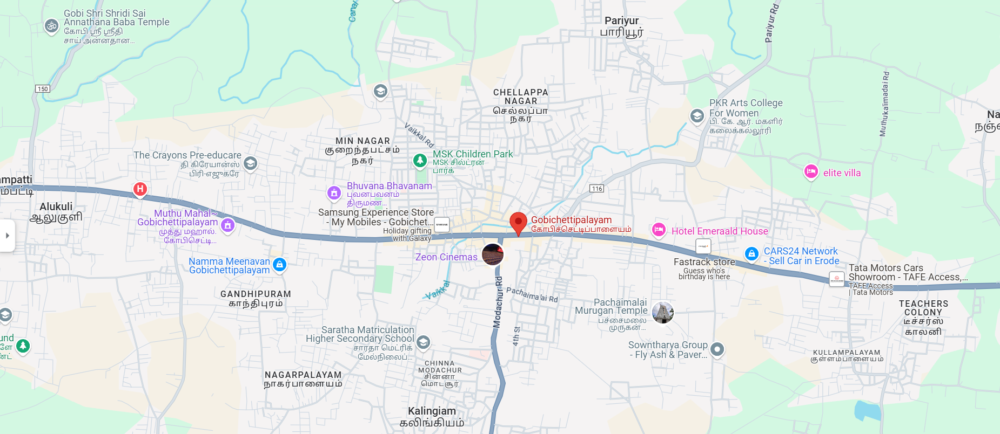
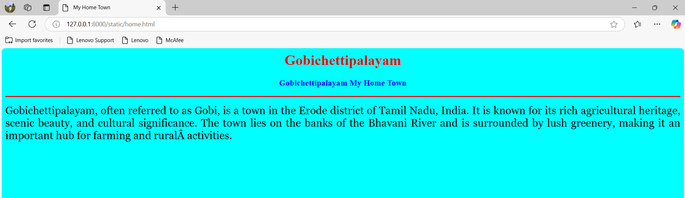
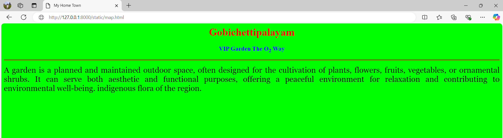
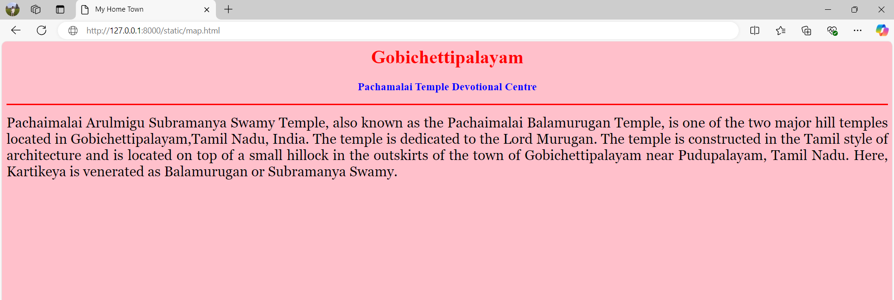

# Ex04 Places Around Me
## Date: 10/12/2024

## AIM
To develop a website to display details about the places around my house.

## DESIGN STEPS

### STEP 1
Create a Django admin interface.

### STEP 2
Download your city map from Google.

### STEP 3
Using ```<map>``` tag name the map.

### STEP 4
Create clickable regions in the image using ```<area>``` tag.

### STEP 5
Write HTML programs for all the regions identified.

### STEP 6
Execute the programs and publish them.

## CODE
```
map.html

<html>

<head>

<title>My City</title>

</head>

<body>

<h1 align="center">

<font color="red"><b>Gobichettipalayam</b></font>

</h1>

<h3 align="center">

<font color="blue"><b>Harieenesh Sha(24002342)</b></font>

</h3>

<center>



<map name="MyCity">


<area shape="rect" coords="700, 250, 850,400" href="home.html" title="My Home Town">
<area shape="circle" coords="570,230,45" href="temple.html" title="pachamalai Temple">
<area shape="circle" coords="1120, 360,25" href="garden.html" title="VIP Garden">
<area shape="rect" coords="950, 120, 1100, 140" href="theter.html" title="zeon theter">

</map>

</center>

</body>

</html>

home.html

<head>

    <title>My Home Town</title>
    
    </head>
    
    <body bgcolor="cyan">
    
    <h1 align="center">
    
    <font color="red"><b>Gobichettipalayam</b></font>
    
    </h1>
    
    <h3 align="center">
    
    <font color="blue"><b>Gobichettipalayam My Home Town</b></font>
    
    </h3>
    
    <hr size="3" color="red">
    
    <p align="justify">
    
    <font face="Georgia" size="5">
        Gobichettipalayam, often referred to as Gobi, is a
         town in the Erode district of Tamil Nadu, India. 
         It is known for its rich agricultural heritage,
          scenic beauty, and cultural significance. 
          The town lies on the banks of the Bhavani River 
          and is surrounded by lush greenery, making it an 
          important hub for farming and rural activities.
    </p>
    
    </body>
    
    </html>
    
    garden.html

<html>

<head>

<title>My Home Town</title>

</head>

<body bgcolor="lime">

<h1 align="center">

<font color="red"><b>Gobichettipalayam</b></font>

</h1>

<h3 align="center">

<font color="blue"><b>VIP Garden The O<sub>2</sub> Way</b></font>

</h3>

<hr size="3" color="red">

<p align="justify">

<font face="Georgia" size="5">
    A garden is a planned and maintained outdoor
 space, often designed for the cultivation of plants,
  flowers, fruits, vegetables, or ornamental shrubs. 
  It can serve both aesthetic and functional purposes, 
  offering a peaceful environment for relaxation and 
  contributing to environmental well-being.
indigenous flora of the region.
</font>

</p>

</body>

</html>
 
 temple.html

 <html>

<head>

<title>My Home Town</title>

</head>

<body bgcolor="pink">

<h1 align="center">

<font color="red"><b>Gobichettipalayam</b></font>

</h1>

<h3 align="center">

<font color="blue"><b>Pachamalai Temple Devotional Centre</b></font>

</h3>

<hr size="3" color="red">

<p align="justify">

<font face="Georgia" size="5">
    Pachaimalai Arulmigu Subramanya Swamy Temple, also known as the Pachaimalai Balamurugan Temple, is one of the two major hill temples located in Gobichettipalayam,Tamil Nadu, India.
     The temple is dedicated to the Lord Murugan. The temple is constructed in the Tamil style of architecture 
     and is located on top of a small hillock in the outskirts of the town of Gobichettipalayam near Pudupalayam, Tamil Nadu.
    Here, Kartikeya is venerated as Balamurugan or Subramanya Swamy.
</p>

</body>

</html>


```

## OUTPUT





## RESULT
The program for implementing image maps using HTML is executed successfully.
